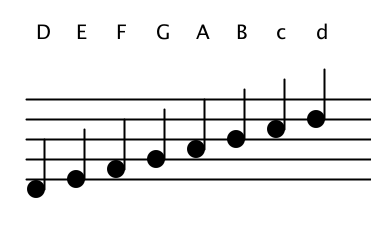
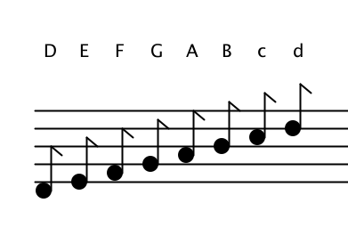

# DT228/DT282 Object Oriented Programming Lab Test 2020-2021

## Instructions

For today's lab test, you will be making a program that parses Strings containing music notes and renders them in stave notation. Here is a video of what your finished program should look like (click the image for the video):

[](https://www.youtube.com/watch?v=MgCmQQzBgl0)

In stave notation, music notes are drawn as circles onto 5 horizontal lines. Certain notes are drawn *on* the lines while others are drawn *between* the lines. For the purpose of today's test, you will be dealing with notes from the scale of *D Major*. There are 8 notes on the scale and they are represented using the characters ```DEFGABcd```. This is what [the scale of D Major sounds like](https://soundcloud.com/skooter500/scale). This is what the 8 notes in the scale of D Major look like in stave notation:



As you can see from the above image, each note is drawn as a circle with a vertical line. The circle position is determined by the note, so the note ```D``` goes just below the bottom line, while ```E``` is drawn on the bottom line and ```F``` is drawn between bottom two lines and so on. 

Note that the vertical spacing between the notes is equal!

For the purpose of this lab test, you will be dealing with two note durations. These are called crotchets (aka quarter notes) and quavers (eight note). A crotchet has no tick while a quaver is drawn with a tick at the top of the vertical line. The scale above is drawn using crotchets. Here is what the above scale looks like when drawn as 8 quavers instead:



In the starter code is a class called ```ScoreDisplay``` where you will code your solution. There is one String field called score that containes the score you will be displaying.

The String is formatted as a sequence of note characters with an optional number after each. If there is no number, then the note is a quaver and you can assign a duration of 1 to the note. If the note has a 2 after it, it's a crotchet and you can assign a duration of 2 to the note. There are other durations, but these are the only ones that we are interested in for the purpose of the test. So as an example, the following String:

```A2F2GGG```

Means: 

| Note | Duration | Type |
|------|----------|------|
| A    | 2        | Crotchet | 
| F    | 2        | Crotchet | 
| G    | 1        | Quaver | 
| G    | 1        | Quaver | 
| G    | 1        | Quaver | 

To complete this test:

- Fork [this repository](https://github.com/skooter500/OOP-Test-2021)
- Clone your fork
- Write a class called Note that has two private fields for note (a char) and duration (an int)
- Write a constructor and appropriate toString method on the class Note
- In the class ScoreDisplay, declare an ArrayList for holding instances of the Note class
- In the class ScoreDisplay, write a method called loadScore that populates the ArrayList from the contents of the String score 
 
	Call this method from setup. You can use the following methods in your solution:

	- [s.charAt](https://docs.oracle.com/javase/7/docs/api/java/lang/String.html#charAt(int))
	- [Character.isDigit](https://docs.oracle.com/javase/7/docs/api/java/lang/Character.html#isDigit(char))

	Also here is *an example* of how to convert a character digit to a number that you will find useful:

	```Java
	char c = '7'; // c holds the character 7 (55)
	int i = c - '0'; // i holds the number 7 (55 - 48)
	```
- Write a method called printScores that iterates over the ArrayList and prints the score like this:

	```
	D       1       Quaver
	E       1       Quaver
	F       2       Crotchet
	F       2       Crotchet
	F       2       Crotchet
	E       1       Quaver
	F       1       Quaver
	A       2       Crotchet
	A       2       Crotchet
	B       2       Crotchet
	A       1       Quaver
	F       1       Quaver
	D       2       Crotchet
	E       2       Crotchet
	D       2       Crotchet
	D       2       Crotchet
	D       2       Crotchet
	```

	Call this method from setup
- Write a method that draws the 5 stave lines
- Write code to draw the notes from the ArrayList as per the video. This code needs to work for all the possible values of the String score that are commented out in the repo
- Write code that renders the music note at the mouseX location in red as per the video above

Marking Scheme:

| Description | Marks |
|-------------|-------|
| Implementing the Note class | 10 |
| Parsing the String into the ArrayList | 30 marks |
| Printing the score | 10 marks |
| Drawing the notes | 30 marks |
| Drawing the highlighted note in red | 10 marks
| Use of git | 10 marks |